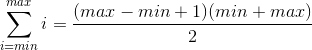

# Sum All Numbers in a Range

Solution Explanation
=======================

One way to solve this challenge is by using the **Arithmetic Series** formula.
In mathematics, an arithmetic progression (AP) or arithmetic sequence is a sequence of numbers such that the difference between the consecutive terms is constant. For instance, the sequence 5, 7, 9, 11, 13, 15 … is an arithmetic progression with common difference of 2.

An **Arithmetic Series** is defined as the sum of an arithmetic progression and can be easily computed by using the following formula:

  

